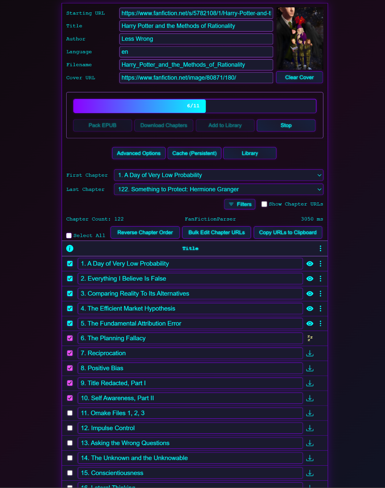
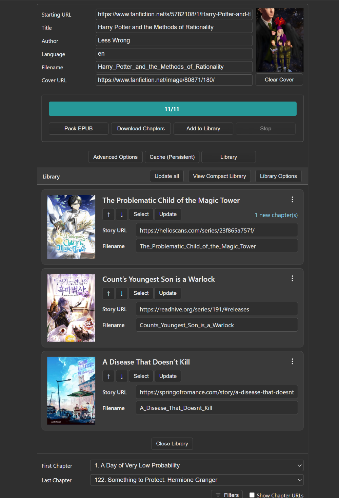
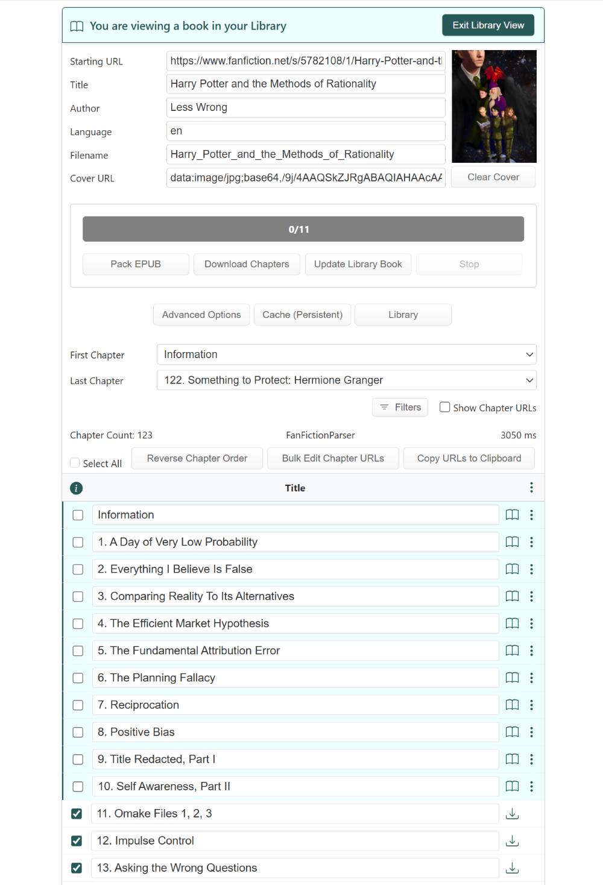

# WebToEpub-Folio

A variant of [WebToEpub](https://github.com/dteviot/WebToEpub) with
additional features, UI enhancements, and theming options.

## About

WebToEpub-Folio builds on the original WebToEpub extension,
which converts web novels and stories to epub format with support
for numerous websites and parsers.

WebToEpub-Folio adds:

- Enhanced responsive UI layouts
- Additional themes and customization options
- Improved visual design elements
- A chapter viewer that allows reading downloaded chapters
- Chapter caching to avoid unnecessary redownloading
- Deeper library feature integration
    - Automatic "Library Mode" for viewing a story that is a current library book
    - Read chapters from library books with the chapter viewer
    - More options to edit library books
        - Delete and re-order chapters
        - Add targeted chapters
        - Refresh targeted chapters from source
    - Treat library books as a cache tier for individual chapters

This fork explores alternative approaches to user interface and user experience
while maintaining compatibility with WebToEpub's core functionality.

## Screenshots

*Cyberpunk theme with responsive layout - shown while downloading chapters*

*Library open in list mode - using Dark theme*

*UI in 'Library Mode' - using Light theme*

*Chapter viewer open - using Sunset theme*

## Relationship to Original

This project maintains an active relationship with the upstream
WebToEpub project. Changes to the upstream project are incorporated
here and selected improvements here are contributed back via pull
requests to benefit the broader userbase.

## Use as Library

WebToEpub-Folio works as a standalone extension and development is in
progress to make it embeddable for other GPL v3 compatible extensions.

## Credits

Built on [WebToEpub](https://github.com/dteviot/WebToEpub) by
[dteviot](https://github.com/dteviot). Core functionality and
many features remain from the original excellent work.

## Installation

The original project offers installation instructions that apply
to WebToEpub-Folio as well.

## Contributing

Contributions are welcome! Please note our contribution workflow:

### UI/UX Enhancements

Pull requests for improvements to features unique to WebToEpub-Folio such as:
- themes
- responsive layouts
- visual design and user interface elements
- the chapter viewer
- caching
- the updated library integration

are welcome here in WebToEpub-Folio.

### Core Functionality

For changes to epub conversion logic, parsing, support for new websites,
or other core functionality, please contribute directly to the
[original WebToEpub project](https://github.com/dteviot/WebToEpub).
This ensures:
- Your improvements benefit the entire WebToEpub community
- Changes are reviewed by the domain experts
- Updates flow naturally into Folio when we incorporate new changes

### Sync Process

WebToEpub-Folio regularly incorporates updates from the upstream project to
stay current with improvements and bug fixes. Core functionality changes made
upstream will appear in future Folio releases.

### Questions?

Not sure which repo to contribute to? Feel free to open an issue here, and
we'll help you find the right home for your contribution.